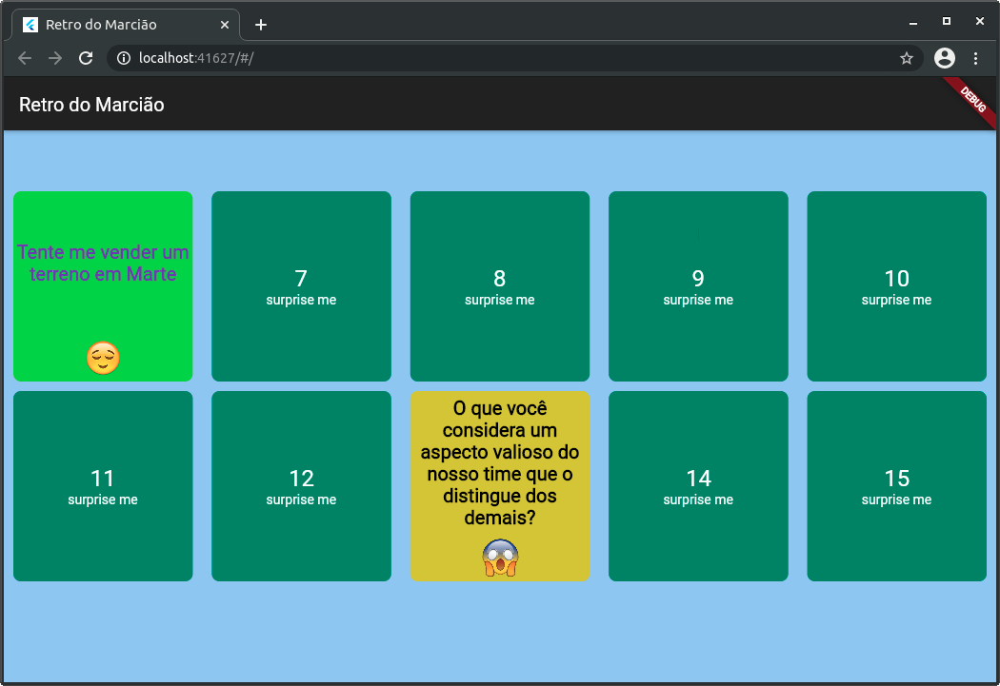
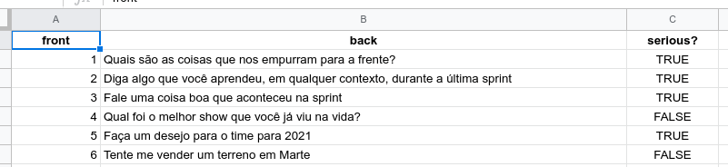

# retro-flutter

## Um projeto usando flip cards em flutter para uma sessão de retrospectiva ágil



---

O "backend" é uma planilha do Google - [modelo](https://docs.google.com/spreadsheets/d/1kkc-rEEyM7bv5CaUc41jtwabTwEXVofZfHCLVwt_L-Q/edit?usp=sharing)



Trecho de código que obtém os dados da planilha como JSON:

```dart
class CardApi {
  static Future<List<CardModel>> getCardList() async {
    var url =
        'https://script.google.com/macros/s/AKfycbw3PRc-UgVK7Ro3DYIiGcCRv0CR0oWrdr3O-eYAz7L3RXNqJgop6FPpaQCfyPHqa3ysPw/exec';
    return await http.get(url).then((response) {
      var jsonCard = convert.jsonDecode(response.body) as List;
      return jsonCard.map((json) => CardModel.fromJson(json)).toList();
    });
  }
}
```

O código do script do [Google Apps Scripts](https://developers.google.com/apps-script) para servir o json com os dados está no arquivo [flipapi.gs](flipapi.gs)

O arquivo [mock.json](mock.json) contém a resposta da requisição e pode ser usado em uma ferramenta de mock, como o [Mockoon](https://mockoon.com)

## build

### web

`flutter build web --release`

## run

### local

- iniciar um servidor web

```bash
cd build/web
python -m SimpleHTTPServer 8069
```

- abra o endereço http://localhost:8069 no browser

## dependências

- Para criar os cards, usei o package [flip_dart](https://github.com/fedeoo/flip_card)
- Para a requisição http usei uma lib assíncrona - [http](https://pub.dev/packages/http)
